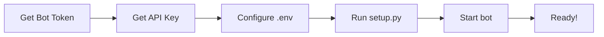

# Usage Flow Examples

## User Journey: First Time Setup to Daily Use

### 1️⃣ Initial Setup (5 minutes)



**Commands:**
```bash
# Step 1-2: Get tokens from BotFather and OpenAI/Gemini
# Step 3:
cp .env.example .env
# Edit .env with your tokens

# Step 4:
python setup.py

# Step 5:
python -m app.main
```

### 2️⃣ First Conversation

**User opens Telegram and starts bot:**

```
User: /start
```

**Bot responds:**
```
👋 Welcome to Virtual Council Assistant!

I'm here to help you manage your projects and build your knowledge base.

Just send me messages about your projects, and I'll:
- Classify and organize your messages
- Build a searchable knowledge base
- Suggest next steps for your projects

Available commands:
/start - Show this welcome message
/help - Show help information
/projects - List active projects
/nextsteps <project_name> - Get suggestions for a project

Just send me any message to get started!
```

### 3️⃣ Daily Usage Examples

#### Example 1: Feature Request

**User:**
```
Working on the authentication API. Need to implement 
JWT tokens with refresh token logic and secure storage.
```

**Bot:**
```
✅ Message processed!

Category: feature_request
Confidence: 0.92

Summary: Implementation task for JWT token authentication 
in API with refresh token mechanism and secure storage

Tags: authentication, api, jwt, security, tokens

Linked to project: Authentication System (id: abc-123)
```

**What happened behind the scenes:**
1. Message saved to database ✅
2. AI classified the message ✅
3. Knowledge extracted and stored ✅
4. Linked to relevant project ✅
5. User notified ✅

#### Example 2: Question/Research

**User:**
```
What's the best way to implement rate limiting 
for our API endpoints?
```

**Bot:**
```
✅ Message processed!

Category: question
Confidence: 0.87

Summary: Research question about API rate limiting 
implementation strategies

Tags: api, rate-limiting, infrastructure, performance

Linked to project: API Development (id: def-456)
```

#### Example 3: Bug Report

**User:**
```
Found a bug in the login flow. Users can't reset 
their password when 2FA is enabled.
```

**Bot:**
```
✅ Message processed!

Category: bug_report
Confidence: 0.95

Summary: Password reset functionality broken when 
two-factor authentication is active

Tags: bug, authentication, password-reset, 2fa, critical

Linked to project: Authentication System (id: abc-123)
```

#### Example 4: Getting Next Steps

**User:**
```
/nextsteps Authentication System
```

**Bot:**
```
🔍 Getting next steps for project: Authentication System

Based on recent discussions and knowledge base:

1. **Implement JWT Refresh Token Logic** (Priority: 5)
   - Add refresh token generation and validation
   - Implement token rotation mechanism
   - Set up secure storage for refresh tokens
   Resources: 
   - JWT Best Practices Guide
   - OWASP Authentication Cheat Sheet

2. **Fix Password Reset with 2FA** (Priority: 5)
   - Debug password reset flow
   - Handle 2FA bypass for password reset
   - Add comprehensive tests
   Resources:
   - 2FA Implementation Guide

3. **Implement Rate Limiting** (Priority: 4)
   - Research rate limiting strategies
   - Choose between Redis or in-memory
   - Apply to all API endpoints
   Resources:
   - Rate Limiting Patterns
   - Redis Documentation
```

### 4️⃣ Advanced Usage

#### Listing Projects

**User:**
```
/projects
```

**Bot:**
```
📊 Active Projects:

1. Virtual Council Infrastructure
   - IaC for Virtual Council platform using Terraform
   - Status: Active

2. AI Assistant Development  
   - AI-powered assistant for project management
   - Status: Active

3. Authentication System
   - Secure authentication with JWT and 2FA
   - Status: Active

4. Knowledge Base System
   - Comprehensive knowledge base with semantic search
   - Status: Active
```

#### Getting Help

**User:**
```
/help
```

**Bot:**
```
📚 Virtual Council Assistant Help

How to use:
1. Send me messages about your work, ideas, or questions
2. I'll analyze and categorize them
3. Access your organized knowledge anytime

Commands:
/start - Welcome message
/help - This help message  
/projects - List all active projects
/nextsteps <project_name> - Get AI-powered suggestions

Example:
Send: 'Working on the new API design for authentication'
I'll classify it, extract key info, and link it to relevant projects!
```

## 🔄 Typical Daily Workflow

```
Morning:
├── Send summary of what you plan to work on
├── Bot classifies and links to projects
└── Get next steps suggestions

During Work:
├── Share progress updates
├── Ask questions  
├── Report bugs
├── Request features
└── Bot organizes everything

Evening:
├── Review what was captured
└── Plan tomorrow based on suggestions
```

## 📊 Data Flow Visualization

```
User Message (Telegram)
        │
        ▼
   Bot Receives
        │
        ▼
   Save to DB ──────────────┐
        │                    │
        ▼                    │
   Get Projects              │
        │                    │
        ▼                    │
   AI Classification         │
        │                    │
        ▼                    │
   Extract Knowledge         │
        │                    │
        ▼                    │
   Save Knowledge ◄──────────┘
        │
        ▼
   Link to Project
        │
        ▼
   Mark Processed
        │
        ▼
   Send Response
        │
        ▼
   User (Telegram)
```

## 💡 Tips for Best Results

1. **Be Specific**: More details = better classification
   ```
   ❌ "Working on auth"
   ✅ "Implementing JWT authentication with refresh tokens for the API"
   ```

2. **Use Natural Language**: Write as you would to a colleague
   ```
   ✅ "Found a bug where users can't login with special characters in password"
   ✅ "Need to research best practices for API rate limiting"
   ```

3. **Regular Updates**: Share progress frequently
   ```
   "Completed JWT implementation, now working on refresh token logic"
   ```

4. **Ask Questions**: The bot helps with research
   ```
   "What's the best way to handle session timeouts?"
   ```

## 🎯 Use Cases

### For Individual Developers
- Track personal projects
- Build knowledge base of learnings
- Get AI-powered suggestions
- Never lose important ideas

### For Small Teams
- Shared project tracking
- Collective knowledge base
- Async communication
- Decision history

### For Research
- Organize research notes
- Link findings to projects
- Get related suggestions
- Build comprehensive knowledge

## 🚀 Next Level Usage

### Custom Projects
Create specific projects for better organization:
```python
# Use manage_projects.py script
python examples/manage_projects.py
```

### Knowledge Search
Search your accumulated knowledge:
```python
# Coming soon: /search command
/search "JWT authentication"
```

### Export Data
Export your knowledge base:
```python
# Coming soon: Export functionality
/export markdown
```

## 📈 What Gets Better Over Time

1. **Classification Accuracy**: More data = better AI understanding
2. **Suggestions Quality**: Learns your project patterns
3. **Knowledge Base**: Grows with every message
4. **Context Awareness**: Understands your project ecosystem

## 🎓 Learning the System

**Week 1**: Getting comfortable
- Send simple messages
- Explore commands
- Review classifications

**Week 2**: Building knowledge
- More detailed messages
- Use tags effectively
- Review accumulated knowledge

**Week 3+**: Power user
- Natural workflow integration
- Leverage AI suggestions
- Maintain organized projects

---

**Remember**: The more you use it, the more valuable it becomes! ��
